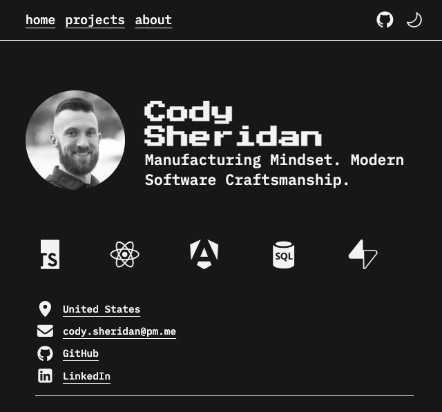

<p align="center">
  
</p>

[Cody Sheridan's development portfolio](https://codysheridan.com) and resume site based on [RATIU5's Zaggonaut](https://github.com/RATIU5/zaggonaut) Astro theme.
Zaggonaut is a retro-inspired theme for Astro, built using TypeScript, TailwindCSS, and of course, Astro.

## Getting Started

[View the demo](https://zaggonaut.dev) or [view the original source code](https://github.com/RATIU5/zaggonaut).

Alternatively, you can create a new Astro project with Zaggonaut like this:

```bash
# pnpm
pnpm create astro@latest --template RATIU5/zaggonaut
```

> [!IMPORTANT]  
> Currently, `pnpm` is the only supported package manager due to `pnpm` throwing peer-dependency conflicts.

## Features

- Content Collections
- Dark & light mode
- Customizable colors
- 100 / 100 Lighthouse score
- Fully accessible
- Fully responsive
- Type-safe
- SEO-friendly

## Customization

The entire theme is fully customizable. The theme is setup a specific way to make it easy to customize.

### Colors

You can customize the colors of the theme by editing the `src/styles/global.css` file.
This file uses Tailwind CSS and CSS variables to customize the colors of the theme.
Zaggonaut uses the following CSS variables:

- `--color-zag-dark`: The dark color of the theme
- `--color-zag-light`: The light color of the theme
- `--color-zag-dark-muted`: The dark color of the theme with a slight opacity
- `--color-zag-light-muted`: The light color of the theme with a slight opacity
- `--color-zag-accent-light`: The light accent color of the theme
- `--color-zag-accent-light-muted`: The light accent color of the theme with a slight opacity
- `--color-zag-accent-dark`: The dark accent color of the theme
- `--color-zag-accent-dark-muted`: The dark accent color of the theme with a slight opacity

### Content Customization

95% of the content you'll want to customize will be located inside the `content` directory. Let's break down the specific files/directories you may want to edit:

- `content/configuration.toml`: This file contains the site configuration, such as metadata, social links, and text content.

- `content/resume.json`: This file contains a professional resume displayed on the about page.

- `content/projects/`: This directory contains your projects. Each project is a Markdown file also with metadata in the frontmatter.

## Ready To Try?

Check out [the theme website](https://zaggonaut.dev) to give it a spin!
